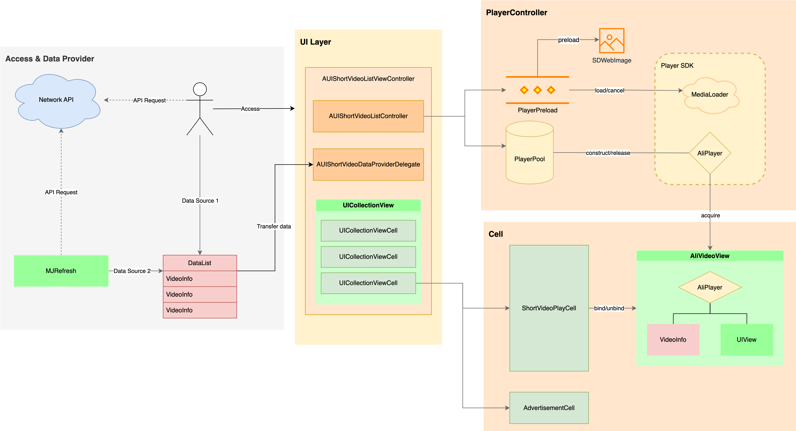

# **AUIShortVideoList**

## **一、组件介绍**

**AUIShortVideoList** 模块使用多个播放器实例（AliPlayer）+ 预加载（MediaLoader）+ 预渲染的方式实现短视频列表播放，结合本地缓存可以达到极致全屏秒开体验。

## **二、模块说明**

### **目录结构**

```html
.
└── AUIShortVideoList
    ├── AUIShortVideoList.podspec # 模块的 Podspec 文件
    ├── Resources
    │   └── AUIShortVideoList.bundle # 资源文件包
    ├── Source
    │   ├── AUIPlayer-Brigding-Header.h # Swift 使用 Objective-C 的桥接头文件（示例）
    │   ├── AUIShortVideoList.h # 模块的前缀头文件
    │   ├── AUIShortVideoListGlobalSetting.h # 短视频播放的全局配置类
    │   ├── AUIShortVideoListGlobalSetting.m
    │   ├── AUIShortVideoListViewController.h # 短视频列表播放视图控制器
    │   ├── AUIShortVideoListViewController.m
    │   ├── Cell # 短视频列表播放的单元格组件
    │   │   ├── AUIShortVideoAdvertisementCell.h # 短视频广告单元格类
    │   │   ├── AUIShortVideoAdvertisementCell.m
    │   │   ├── AUIShortVideoPlayCell.h # 短视频播放单元格类
    │   │   └── AUIShortVideoPlayCell.m
    │   ├── Component # 短视频列表播放视图组件
    │   ├── Controller # 短视频列表播放控制器
    │   │   ├── AUIShortVideoListController.h # 短视频列表播放页面控制器
    │   │   ├── AUIShortVideoListController.m
    │   │   ├── Player # 播放器相关组件
    │   │   │   ├── AliLinkedHashMap.h # 自实现的链表数据结构
    │   │   │   ├── AliLinkedHashMap.m
    │   │   │   ├── AliPlayerPool.h # 多实例播放器池
    │   │   │   ├── AliPlayerPool.m
    │   │   │   ├── AliVideoView.h # 视频渲染与播放组件
    │   │   │   └── AliVideoView.m
    │   │   └── Preload # 预加载相关组件
    │   │       ├── AliPlayerPreload.h # 预加载器
    │   │       ├── AliPlayerPreload.m
    │   │       ├── AliSlidingWindow.h # 滑动窗口抽象类
    │   │       └── AliSlidingWindow.m
    │   ├── Data # 短视频列表播放的数据结构
    │   │   ├── AUIShortVideoInfo.h # 存储视频信息的数据类
    │   │   ├── AUIShortVideoInfo.m
    │   │   ├── AUIShortVideoListConstants.h # 短视频列表功能相关的常量和配置
    │   │   ├── AUIShortVideoListConstants.m
    │   │   ├── AUIShortVideoListDataManager.h # 短视频数据管理器类
    │   │   └── AUIShortVideoListDataManager.m
    │   └── Util # 短视频列表播放的工具类
    ├── Wikis # 模块文档
```

### **逻辑架构**



## **三、集成准备**

参考 [集成准备](./Integration.md)

## **四、快速开始**

参考 [快速开始](./QuickStart.md)

## **五、核心能力**

参考 [核心能力](./CoreFeatures.md)

## 六、用户指引

### **文档**

[播放器SDK](https://help.aliyun.com/zh/vod/developer-reference/apsaravideo-player-sdk/)

[音视频终端SDK](https://help.aliyun.com/product/261167.html)

[阿里云·视频点播](https://www.aliyun.com/product/vod)

[视频点播控制台](https://vod.console.aliyun.com)

[ApsaraVideo VOD](https://www.alibabacloud.com/zh/product/apsaravideo-for-vod)


### **FAQ**

[播放异常自主排查](https://help.aliyun.com/zh/vod/developer-reference/troubleshoot-playback-errors)

