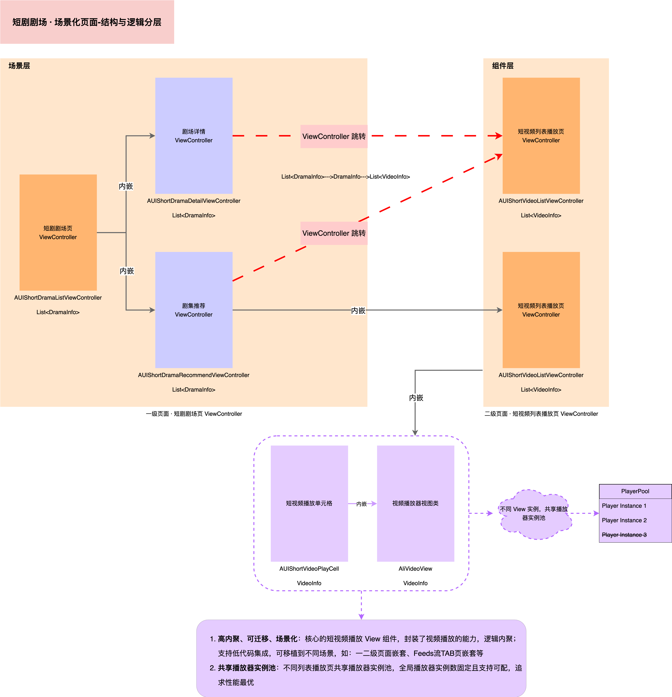

# **AUIShortDramaList**

## **一、场景介绍**

**AUIShortDramaList** 模块是短剧剧场场景化模块，基于 **AUIShortVideoList** 组件实现。该模块提供剧场详情页和剧场推荐页，支持一二级页面嵌套和播放器实例共享。

## **二、场景说明**



## **三、场景集成**

### **集成准备**

在进行短剧剧场场景搭建之前，请确保已完成 **AUIShortVideoList** 组件的集成准备。

### **集成步骤**

1. 拷贝模块

   将 AUIShortDramaList 模块复制到您的项目工程中。

2. 配置 Podfile

   在项目的 Podfile 中添加对 AUIShortDramaList 模块的引用和依赖。示例配置如下：

   ```ruby
   # Pod Example
   install! 'cocoapods', :deterministic_uuids => false
   source 'https://github.com/CocoaPods/Specs.git'
   
   platform :ios, '9.0'
   
   target 'Your ProjectName' do
     
     # 短剧场景（包含剧场/Feed流）两个模块，可单独集成。
     pod "AUIPlayer/AUIPlayerScenes", :path => "../"
     # 短剧剧场场景
   #  pod "AUIPlayer/AUIPlayerScenes/AUIShortDramaList", :path => "../"
   
   end
   
   post_install do |installer|
     installer.pods_project.build_configurations.each do |config|
         config.build_settings['CLANG_WARN_DOCUMENTATION_COMMENTS'] = 'NO'
         config.build_settings['CLANG_WARN_QUOTED_INCLUDE_IN_FRAMEWORK_HEADER'] = 'NO'
     end
   end
   ```

   请根据您项目中实际存放依赖库的路径进行相应修改。

   注意： 如果您项目中已使用的第三方库的版本与 AUIShortDramaList 源码依赖的版本存在冲突，请以您项目中使用的版本为准。

3. 项目配置

   如果您的项目是 Swift 工程并且需要使用 Objective-C 的第三方库，您必须配置项目的 Build Settings 中的 Objective-C Bridging Header，以确保 Swift 能够正确访问 Objective-C 的接口。请按照以下步骤进行配置：

   * 设置 Bridging Header：

     在项目的 Build Settings 中找到 SWIFT_OBJC_BRIDGING_HEADER 设置，并将其指向您的桥接头文件。示例路径如下：

     ```shell
     <YourProjectName>/<YourProjectName>-Bridge-Header.h
     ```

   * 引入 Objective-C 接口：

     在桥接头文件中，确保引入需要暴露给 Swift 的 Objective-C 接口，示例如下：

     ```swift
     #import "AUIShortDramaList.h"
     ```

   通过上述配置，您的 Swift 代码将能够正常访问和使用 AUIShortDramaList 模块中的 Objective-C 接口。

   您可以参考 AUIShortVideoList 模块中的 AUIPlayer-Bridging-Header.h 文件，获取更多示例和指导。

4. 编译与运行

   完成配置后，请编译并运行项目，以确保 AUIShortDramaList 组件已被正确集成。

## **四、快速开始**

### **使用方法**

您可以通过以下方式将短剧剧场的 ViewController 页面直接提供给外部进行跳转。

Objective-C 示例：

```objective-c
- (void)openShortDramaList {
    AUIShortDramaListViewController *vc = [[AUIShortDramaListViewController alloc] init];
    [self.navigationController pushViewController:vc animated:YES];
}
```

Swift 示例：

```swift
func openShortDramaList() {
    let vc = AUIShortDramaListViewController()
    navigationController?.pushViewController(vc, animated: true)
}
```

### **获取数据**

AUIShortDramaList 模块使用的数据结构为 `NSMutableArray<AUIShortDramaInfo *>`，其中 `AUIShortDramaInfo` 为存储短剧剧集的数据类，其数据结构如下：

| 字段       | 类型                                  | 释义     | 备注                                  |
| ---------- | ------------------------------------- | -------- | ------------------------------------- |
| dramaId    | NSInteger                             | 剧集 id  |                                       |
| title      | NSString *                            | 剧集标题 |                                       |
| cover      | NSString *                            | 剧集封面 |                                       |
| firstDrama | AUIShortVideoInfo *                   | 剧集首集 | firstDrama 为 dramas 中的第一集       |
| dramas     | NSMutableArray<AUIShortVideoInfo *> * | 剧集列表 | 可作为 AUIShortVideoList 模块的数据源 |

您可以通过网络请求或数据转换这两种方式，获取最终的 `NSMutableArray<AUIShortDramaInfo *>` 数据源。

`AUIShortDramaListViewController` 代码中提供了获取数据的代码示例。该类实现了 `AUIShortVideoDataProviderDelegate` 数据请求代理接口，提供了以下两种主要方法：

* **AUIShortVideoDataProviderDelegate**

```objective-c
@protocol AUIShortVideoDataProviderDelegate <NSObject>
@required
- (void)loadData:(id _Nullable)controller; //加载数据
@optional
- (void)refreshData:(id _Nullable)controller; // 刷新数据（可选）
@end
```

通过 `AUIShortDramaListDataManager` 中提供的 `requestDramaInfoList` 方法进行网络请求，以获取最终的 `NSMutableArray<AUIShortDramaInfo *>` 数据源。获取的数据会存储在内部的 `dramaInfoList` 对象中，用于后续的视图展示和处理。
